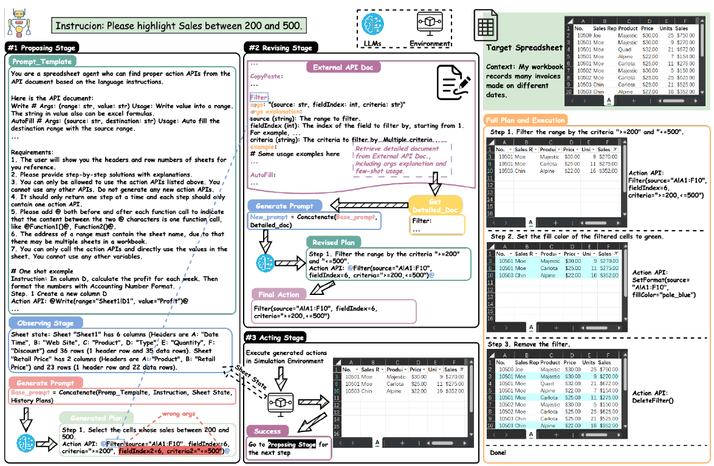
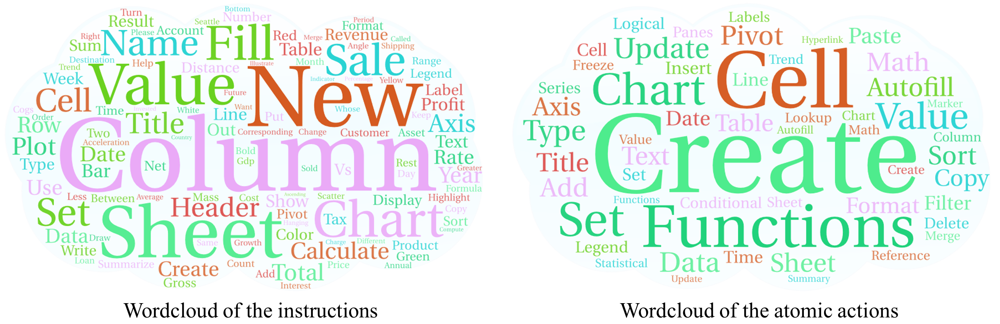
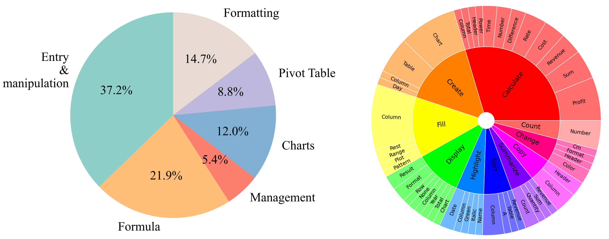
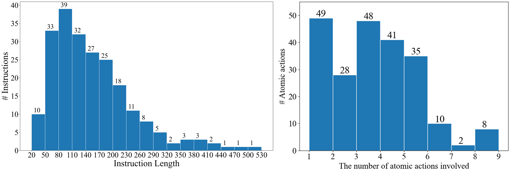
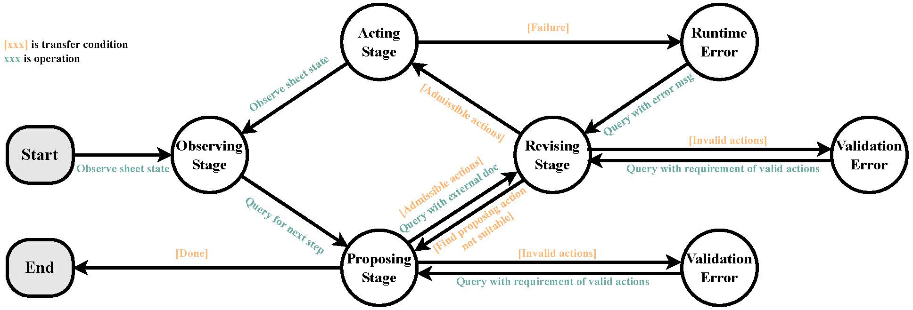
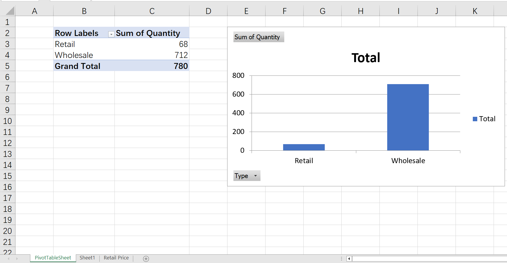
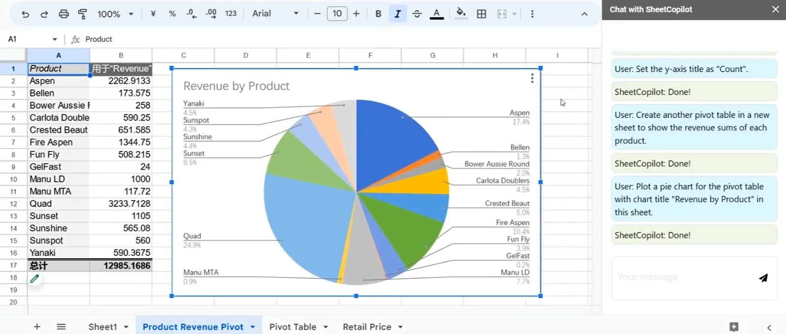
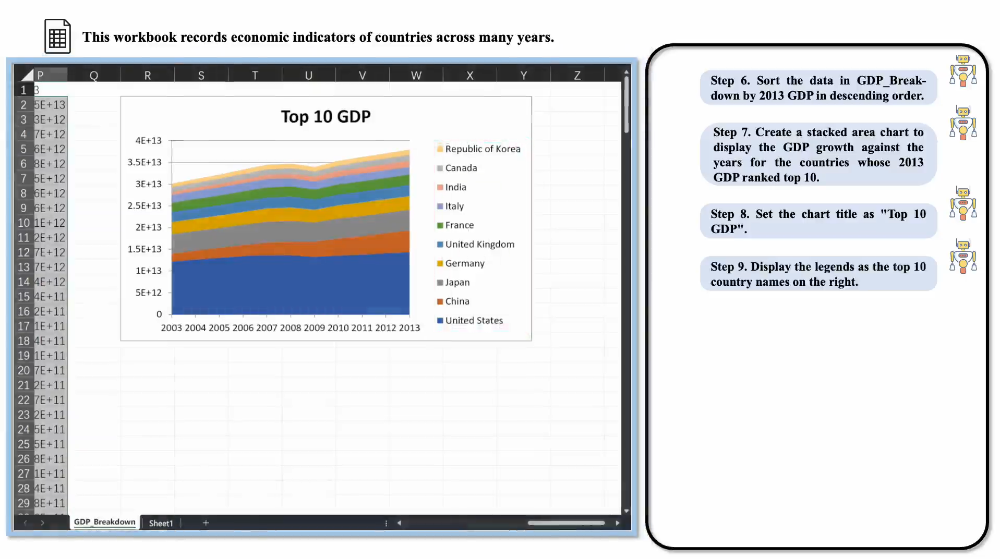

**SheetCopilot**: Bringing Software Productivity to the Next Level through Large Language Models
========

<p align="center">

<br>
<b>SheetCopilot Icon</b>
</p>

<p align="center">
  <a href="#overview">Overview</a> •
  <a href="#setup">Setup</a> •
  <a href="#dataset">Dataset</a> •
  <a href="#sheetcopilot-usage">Sheetcopilot Usage</a> •
  <a href="#evaluation">Evaluation</a> •
  <a href="https://neurips.cc/media/PosterPDFs/NeurIPS%202023/70193.png?t=1698641001.038527">Poster</a> •
  <a href="http://arxiv.org/abs/2305.19308">Paper</a> •
  <a href="#citation">Citation</a>

</p>

<p align="center">
<br />
<a href="https://sheetcopilot-demo.github.io/"><strong>Explore the project website »</strong></a>
<br />
</p>

We release the SheetCopilot as well as the evaluation environment in this repository.

SheetCopilot is an assistant agent that manipulate spreadsheets by following user commands. It breaks new ground in human-computer interaction, opening up possibilities for enabling non-expert users to complete their mandane work on complex software (e.g. Google sheets and Excel) via a language interface.

# Overview

SheetCopilot employs a novel way of directing Large Language Models (LLMs) to manipulate spreadsheets like a human expert. To achieve elegant closed-loop control, SheetCopilot observes the spreadsheet state and polishes generated solutions according to external action documents and error feedback, thereby improving its success rate and efficiency.

<p align="center">

</p>
<br>

**💁‍♂️💁💁‍♀️ Join Us on [Discord](https://discord.gg/XawesbJV)!**

## What's New
- **[2023/11/15]** ✨ **SheetCopilot for Google Sheets was released!** You can now use SheetCopilot directly on Google Sheets.

- **[2023/10/29]** ✨ **Interaction script was uploaded!** You can use SheetCopilot to manipulate your own spreadsheets with just one command line (```agent/interaction.py```).

- **[2023/10/27]** 🛠 **More ground truths!** We increased the number of feasible reference solutions in our benchmark threefold (```dataset/task_sheet_answers_v2```) to obtain more accurate evaluation results.

- **[2023/10/25]** SheetCopilot was open-sourced.

- **[2023/9/22]** 🎉 Our [**paper**](https://openreview.net/forum?id=tfyr2zRVoK) was accepted to NeurIPS 2023.

- **[2023/5/19]** 👷🏻‍♂️ SheetCopilot was completed.

# Setup
### 1. Prepare the Conda environment

SheetCopilot is pnly available on **Windows**. Python 3.10 is required to support the asyncronous implementation of SheetCopilot.

```
conda create -n sheetcopilot python=3.10
```

### 2. In this conda env, run:

```
pip install -r requirements.txt
```


# Dataset
We release a spreadsheet task dataset containing 28 workbooks and 221 tasks applied to these workbooks. Each task is given one or more hand-made solutions.

Here is the overview of the dataset:

<p align="center">

</p>
<br/>

Our datset contains diverse task categories and involves a wide range of operations:

<p align="center">

</p>
<br/>

Our dataset provides tasks with diverse complexity:

<p align="center">

</p>
<br/>

44 operations are supported and more will be added:

- **Entry & manipulation**: Write, CopyPaste, CutPaste, SetHyperlink, RemoveHyperlink, AutoFill, InsertRow, InsertColumn, Delete, Clear
- **Management**: Sort, Filter, DeleteFilter, MoveRow, MoveColumn, RemoveDuplicate
- **Formatting**: SetFormat, DeleteFormat, SetDataType, SetCellMerge, AutoFit, ResizeRowColumn, SetConditionalFormat, SetDataValidation, SetCellLock, FreezePanes, UnfreezePanes
- **Chart**: CreateChart, SetChartTrendline, SetChartTitle, SetChartHasAxis, SetChartAxis, SetChartHasLegend, SetChartLegend, SetChartType, AddChartErrorBars, RemoveChartErrorBars, AddDataLabels, RemoveDataLabels, SetChartMarker
- **Pivot Table**: CreatePivotTable, CreateChartFromPivotTable, CreateSheet, RemoveSheet

This dataset can be used to evaluate any spreadsheet agent including RL, LLM-based or rule-based methods.

In the ```dataset``` folder, ```dataset.xlsx``` lists the 221 tasks, containing the target workbook name, task number, instruction, task categories, and involved atomic actions.

The fields are explained one-by-one as follows:

- ```Sheet Name```: The name of the sheet this task is applied to.
- ```No.```: The number of this task.
- ```Context```: The brief description of the sheet this task is applied to. This context will be added to the prompt to inform the LLM of the spreadsheet usage.
- ```Instructions```: The task content.
- ```Categories```: Each task is classified into multiple categories according to the atomic actions involved in the task.
- ```Atomic actions```: The atomic actions used to solve the task
- ```Seed task```: The number of the seed task (stored in ```dataset/seed_tasks.xlsx```) this task originates from. Our 221 tasks were produced by adapting the 67 seed tasks to apply them to the task sheets (the ```task_sheets``` folder).

The ```task_sheets``` folder contains the 28 evaluation workbooks these tasks applied to.

The ```task_sheet_answers``` folder contains the reference solutions of the tasks. Each solution consists of a reference workbook showing the expected outcome of the corresponding task and a *.yaml file listing the necessary sheet states to compare. If the necessary states of the result matches one of the references, the result is seen as correct. (The v1 version is used in our paper while the v2 version contains more reference solutions collected after our paper was submitted)

Each solution folder (e.g. ```1_BoomerangSales```) contains at least 1 references, which comprises a final spreadsheet (1_BoomerangSales_gt1.xlsx) and a checking list (1_BoomerangSales_gt1_check.yaml). Different tasks needs differnt atomic actions so the checking lists are tailored to corresponding tasks.

The ```dataset_20Samples.xlsx``` file lists the 20 selected tasks used to compare the representative LLMs in our experiments (Table 1).

To dive deeper into the dataset collection details, refer to this [tutorial](/dataset/collecting_scripts/).

# SheetCopilot Usage

Please set max tokens, temperature, model_name, and API keys in ```config/config.yaml```.

You can see two ChatGPT configs in this file - ChatGPT_1 is used to do planning while ChatGPT_2 is used to revise the format of the planning results. You can set ```use_same_LLM: true``` to use ChatGPT_1 to carry out both the two jobs.

The underlying implementation of SheetCopilot is a state machine which implements planning by transitioning among 4 states (See the below figure). ```max_cycle_times``` is used to limit the number of times the agent visits the states.

<p align="center">

<br>
<b>SheetCopilot State Machine</b>
</p>

<br/>


## Interactive mode

Open an Excel workbook before running this command:

```
python interaction.py -c config/config.yaml
```

Now you can enter any instrcutions and wait for SheetCoilot to finish them without any intervention.

### Example
To try out SheetCopilot conveniently, please open ```example.xlsx``` and enter these instructions in order:

1. Calculate the revenue for each transaction considering corresponding retail price and discount.

2. Highlight the Revenue cells greater than 500 in blue text.

3. Create a pivot table in a new sheet to show the counts of the websites on which boomerangs were sold.

4. Plot a bar chart for the pivot table in the same sheet.

5. Set the y-axis title as "Count" and turn off legends.

6. Create another pivot table in a new sheet to show the revenue sums of each product.

7. Plot a pie chart for the pivot table with chart title "Revenue by Product" in this sheet.

You can also try more vague instructions like: ```Analyze the data and plot charts for the results.```

Afterwards, you will see SheetCopilot create pivot tables and plot proper charts for you (see the figure below).

<p align="center">

<br>
<b>Result of the example task</b>
</p>

[Caution] Any operation executed by SheetCopilot cannot be undone by clicking the "Undo" button! We **strongly** recommend that our users use SheetCopilot on GoogleSheets to automate their spreadsheet tasks.

## Evaluation on our dataset

Inside the ```agent``` folder run this command:

```
python main.py -c config/config.yaml
```

Afterwards, you will see Excel open a spreadsheet automatically to solve all the 221 tasks in order.

If you want to conduct repeated experiments, set ```repeat: 3```.

## For Google Sheets

Open a GoogleSheets spreadsheet and install SheetCopilot on the Google Workspace Market like this:

<p align="center">

<br>
<b>Install SheetCopilot for GoogleSheets</b>
</p>

Then you can hack SheetCopilot happily via chatting ...

<p align="center">

<br>
<b>Let SheetCopilot solve complex tasks for you</b>
</p>

You can undo any operations executed by SheetCopilot by just using ```Ctrl + Z```.

# Evaluation

The results generated by any method should be organized like this:

```
results
  └── ([No.]_[Sheet Name])
  └── 1_BoomerangSales
  |   └── ([No.]_[Sheet Name]_[Repeat_No.].xlsx)
  |   └── 1_BoomerangSales_1.xlsx
  |   ...
  |   └── 1_BoomerangSales_3.xlsx
  ...
  └── 9_BoomerangSales
  ...
  └── 1_Dragging
  ...
  └── 8_Dragging
  ...
```

[Sheet Name] and [No.] are the items in columns A and B in ```dataset.xlsx``` (e.g. 9_BoomerangSales
). [Repeat_NO.] is used to differentiate multiple repeats of the same task. If you run each task only once (controlled by ```repeat```), [Repeat_NO.] is 1.

Run this code within the ```eval``` folder to evaluate your results:
```
python evaluation.py -d [result dir]
```

The evaluation results will be recorded in a file named ```eval_result.yaml``` under the result folder.


The evaluation can restart from a checkpoint if it has been aborted.

**Important:** NOTE that
- Every new sheet must be created to the left of the very first sheet for correct matching with the references since sheet names are not to be checked.
- The sheet content must start from cell A1 and each sheet is required to contain contiguous tables.

## Evaluation results

The performaces of SheetCopilot with 3 leading LLMs as its back-end on ```dataset/dataset_20Samples.xlsx```.

| Models        | Exec@1 | Pass@1 | A50  | A90  |
|---------------|--------|--------|------|------|
| GPT-3.5-Turbo | **85.0%**  | 45.0%  | 2.00 | 4.50 |
| GPT-4         | 65.0%  | **55.0%**  | **1.33** | **2.00** |
| Claude        | 80.0%  | 40.0%  | 1.50 | 4.40 |

The performaces of SheetCopilot and a VBA-based method on ```dataset/dataset.xlsx``` using ```dataset/task_sheet_answers_v1``` as the ground truths.

| Methods       | Exec@1 | Pass@1 |
|---------------|--------|--------|
| GPT-3.5-Turbo | 87.3%  | 44.3%  |
| VBA-based     | 77.8%  | 16.3%  |

## The aspects of a spreadsheet SheetCopilot controls
(1) **Manipulation**: Writing values and formulas, deleting cells, inserting a row/column, autofilling, copy-pasting values, find-and-replacing, setting hyperlinks, removing duplicates, creating sheets, clearing formats.

(2) **Management**: Sorting, filtering, and freezing panes.

(3) **Formatting**: Setting format and conditional format (font, bold, italic, underline, text color, and fill color), setting data type (date, text, number, currency, time, general, percentage), and merging.

(4) **Charts**: Creating charts, creating charts from pivot tabls, setting chart title/axis title/legends/chart type/marker/trendline/data labels.

(5) **Pivot table**: Creating pivot tables.

(More operations will be added once the developers finish testing them. Besides, you can raise issues to ask for more supported operations or pull request to contribute your implementations.) 

## Demo

This video shows that SheetCopilot conducts GDP data analysis successfully.

[](./assets/EasyGDP_Demo.mp4)

This video shows SheetCopilot deployed on Google Sheets.

[](https://youtu.be/69Qu7v55fBY " See the magic of SheetCopilot on Google Sheets - Control your sheets like chatting ")

<br/>

# Citation
SheetCopilot and the dataset can only be used for non-conmercial purposes.

If you use the SheetCopilot framework or data, feel free to cite us.

```bibtex
@inproceedings{
li2023sheetcopilot,
title={SheetCopilot: Bringing Software Productivity to the Next Level through Large Language Models},
author={Hongxin Li and Jingran Su and Yuntao Chen and Qing Li and Zhaoxiang Zhang},
booktitle={Thirty-seventh Conference on Neural Information Processing Systems},
year={2023},
url={https://openreview.net/forum?id=tfyr2zRVoK}
}