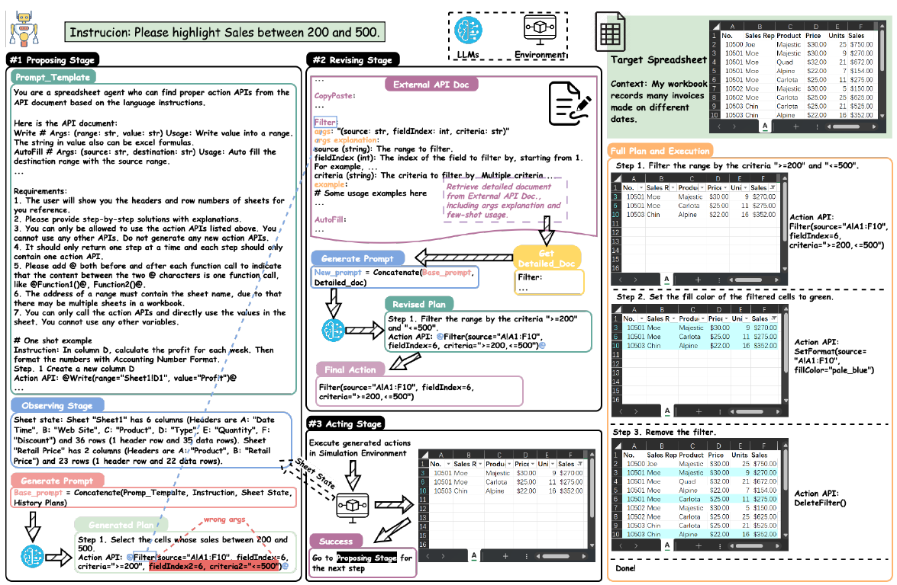
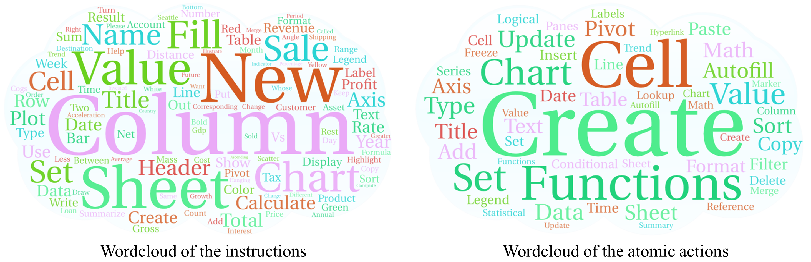
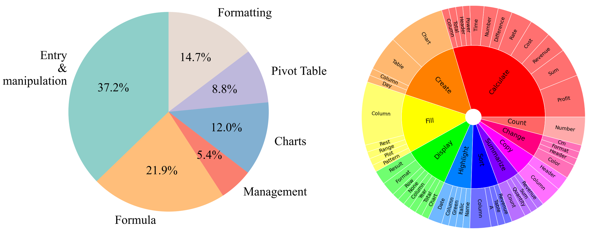
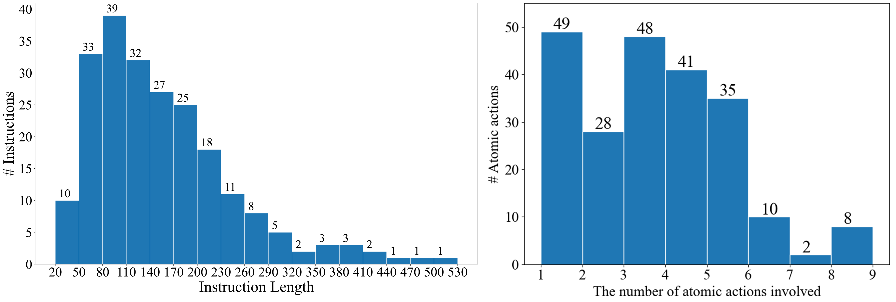
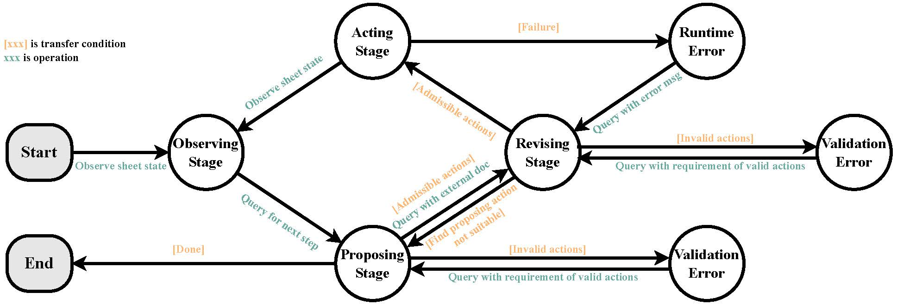
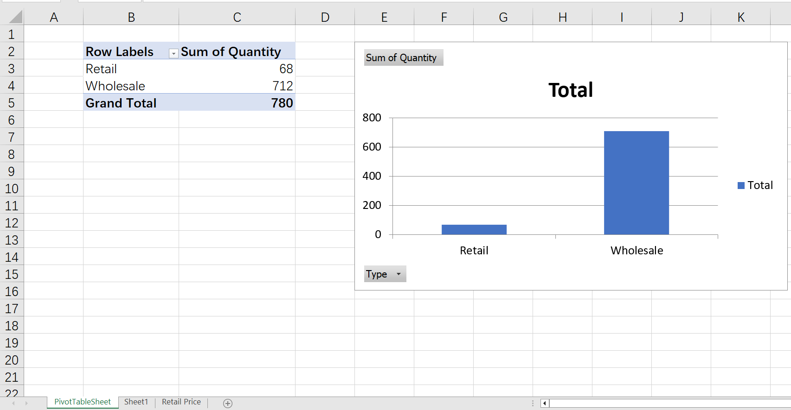
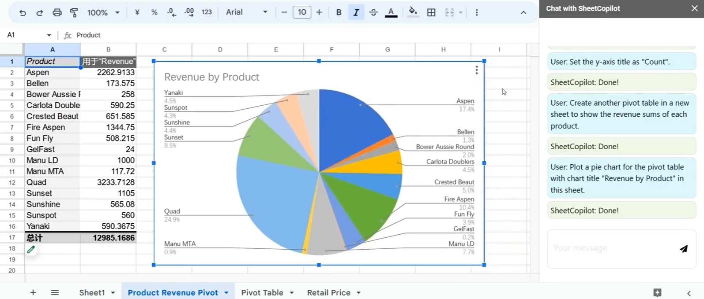
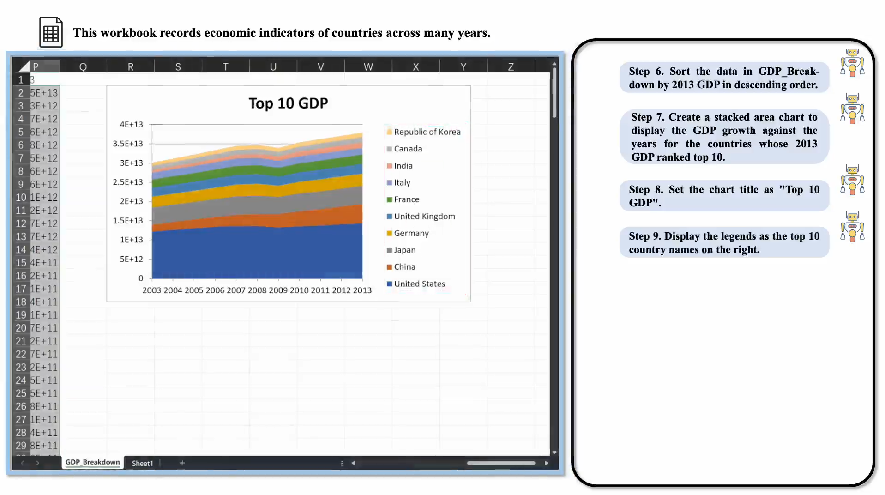

**SheetCopilot**: Bringing Software Productivity to the Next Level through Large Language Models
========

[](http://arxiv.org/abs/2305.19308) 
[](https://GitHub.com/Naereen/StrapDown.js/graphs/commit-activity) 
[]()

<p align="center">

<br>
<b>SheetCopilot Icon</b>
</p>

<p align="center">
  <a href="#overview">Overview</a> •
  <a href="#setup">Setup</a> •
  <a href="#dataset">Dataset</a> •
  <a href="#sheetcopilot-usage">Sheetcopilot Usage</a> •
  <a href="#evaluation">Evaluation</a> •
  <a href="https://neurips.cc/media/PosterPDFs/NeurIPS%202023/70193.png?t=1698641001.038527">Poster</a> •
  <a href="http://arxiv.org/abs/2305.19308">Paper</a> •
  <a href="#citation">Citation</a>

</p>

<p align="center">
<br />
<a href="https://sheetcopilot-demo.github.io/"><strong>Explore the project website »</strong></a>
<br />
</p>

We release the SheetCopilot  agent as well as the evaluation environment in this repository.

SheetCopilot is an assistant agent that manipulates spreadsheets by following user commands. It breaks new ground in human-computer interaction, opening up possibilities for enabling non-expert users to complete their mundane work on complex software (e.g. Google Sheets and Excel) via a language interface.

## What's New
- **[2026/06/25]** 🐧 **Linux/Ubuntu support + new tooling — no Windows/Excel required.** See [`agent/README_ubuntu_eval.md`](agent/README_ubuntu_eval.md) for details. The original Windows scripts are untouched.
  - **Excel-free evaluation**: `agent/evaluation_ubuntu.py` reproduces the exact outcome metrics (Exec@1/Pass@1/A50/A90) with a hybrid **openpyxl + headless-LibreOffice (UNO)** backend — verified to match the original Windows/Excel evaluator and validated by op/non-op reliability tests.
  - **Modern OpenAI SDK + bring-your-own-model**: `agent/utils/ChatGPT.py` upgraded to `openai>=1.40` (tested on 2.x); works with any OpenAI-compatible endpoint (vLLM/Ollama/gateways) and reasoning models via streaming.
  - **Detailed trajectory logging**: each task attempt is saved as one structured JSON (full query, response, reasoning, token usage, latency, parsed/executed actions).
  - **Planning probe**: `agent/run_planning_probe.py` tests any model's SheetCopilot planning on N tasks without Excel.
  - **Claude Code as an alternative agent**: `agent/claude_code_agent.py` solves the tasks with the Claude Code CLI (edits workbooks via Python/LibreOffice); scored by the same evaluator.
  - **Trajectory visualizer**: `agent/visualize_trajectories.py` renders all trajectories into one self-contained HTML page (state-machine path, per-call query/response/reasoning/usage/actions, eval-overlaid pass/fail) to inspect *why* tasks fail.
- **[2024/02/24]** 🛠 Full SheetCopilot was released.
- **[2023/12/26]** 🛠 SheetCopilot equipped with Chain-of-Thoughts and external document retrieval was released.
- **[2023/11/15]** ✨ **SheetCopilot for Google Sheets was released!** You can now use SheetCopilot directly on Google Sheets. Check out our Google Sheets plugin store [page](https://workspace.google.com/u/0/marketplace/app/sheetcopilot/393386705978) and watch this [tutorial](https://sheetcopilot.github.io/support.html) for installation and usage guide.

- **[2023/10/27]** 🛠 **More ground truths!** We added more reference solutions to our benchmark (```dataset/task_sheet_answers_v2```) to obtain more accurate evaluation results.

- **[2023/10/25]** SheetCopilot benchmark was open-sourced.

- **[2023/9/22]** 🎉 Our [**paper**](https://openreview.net/forum?id=tfyr2zRVoK) was accepted to NeurIPS 2023.

- **[2023/5/19]** 👷🏻‍♂️ SheetCopilot was completed.

## TODO
- Update the function call parsing code to fix the quote parsing errors
- Update API implementations
- Update the evaluation script to improve the checking accuracy

# Overview

SheetCopilot employs a novel way of directing Large Language Models (LLMs) to manipulate spreadsheets like a human expert. To achieve elegant closed-loop control, SheetCopilot observes the spreadsheet state and polishes generated solutions according to external action documents and error feedback, thereby improving its success rate and efficiency.

<p align="center">

</p>
<br>

# Setup
### 1. Prepare the Conda environment

SheetCopilot is only available on **Windows**. Python 3.10 is required to support the asynchronous implementation of SheetCopilot.

```
conda create -n sheetcopilot python=3.10
```

### 2. In this conda env, run:

```
pip install -r requirements.txt
```


# Dataset
We released a spreadsheet task dataset containing 28 workbooks and 221 tasks applied to these workbooks. Each task is given one or more hand-made solutions.

Here is the overview of the dataset:

<p align="center">

</p>
<br/>

Our dataset contains diverse task categories and involves a wide range of operations:

<p align="center">

</p>
<br/>

Our dataset provides tasks with diverse complexity:

<p align="center">

</p>
<br/>

44 operations are supported and more will be added:

- **Entry & manipulation**: Write, CopyPaste, CutPaste, SetHyperlink, RemoveHyperlink, AutoFill, InsertRow, InsertColumn, Delete, Clear
- **Management**: Sort, Filter, DeleteFilter, MoveRow, MoveColumn, RemoveDuplicate
- **Formatting**: SetFormat, DeleteFormat, SetDataType, SetCellMerge, AutoFit, ResizeRowColumn, SetConditionalFormat, SetDataValidation, SetCellLock, FreezePanes, UnfreezePanes
- **Chart**: CreateChart, SetChartTrendline, SetChartTitle, SetChartHasAxis, SetChartAxis, SetChartHasLegend, SetChartLegend, SetChartType, AddChartErrorBars, RemoveChartErrorBars, AddDataLabels, RemoveDataLabels, SetChartMarker
- **Pivot Table**: CreatePivotTable, CreateChartFromPivotTable, CreateSheet, RemoveSheet

This dataset can be used to evaluate any spreadsheet agent including RL, LLM-based, or rule-based methods.

In the ```dataset``` folder, ```dataset.xlsx``` lists the 221 tasks, containing the target workbook name, task number, instruction, task categories, and involved atomic actions.

The fields are explained one by one as follows:

- ```Sheet Name```: The name of the sheet this task is applied to.
- ```No.```: The number of this task.
- ```Context```: The brief description of the sheet this task is applied to. This context will be added to the prompt to inform the LLM of the spreadsheet usage.
- ```Instructions```: The task content.
- ```Categories```: Each task is classified into multiple categories according to the atomic actions involved in the task.
- ```Atomic actions```: The atomic actions used to solve the task
- ```Seed task```: The number of the seed task (stored in ```dataset/seed_tasks.xlsx```) this task originates from. Our 221 tasks were produced by adapting the 67 seed tasks to apply them to the task sheets (the ```task_sheets``` folder).

The ```task_sheets``` folder contains the 28 evaluation workbooks these tasks are applied to.

The ```task_sheet_answers``` folder contains the reference solutions of the tasks. Each solution consists of a reference workbook showing the expected outcome of the corresponding task and a *.yaml file listing the necessary sheet states to compare. If the necessary states of the result match those of one of the references, the result is seen as correct. (The v1 version is used in our paper while the v2 version contains more reference solutions collected after our paper was submitted)

Each solution folder (e.g. ```1_BoomerangSales```) contains at least 1 reference, which comprises a final spreadsheet (1_BoomerangSales_gt1.xlsx) and a checking list (1_BoomerangSales_gt1_check.yaml). Different tasks need different atomic actions so the checking lists are tailored to corresponding tasks.

The ```dataset_20Samples.xlsx``` file lists the 20 selected tasks used to compare the representative LLMs in our experiments (Table 1).

To dive deeper into the dataset collection details, refer to this [tutorial](/dataset/collecting_scripts/).

# SheetCopilot Usage

## For Excel
This repo releases a simplified version of the SheetCopilot agent, whose state machine can do CoT reasoning and retrieve external documents.

SheetCopilot calls customized atomic actions to execute its generated solutions. We implement each atomic action using the ```pywin32``` library. Please refer to [API definitions](/agent/Agent/xwAPI.py) to see the details. To compare with our SheetCopilot, your own agents should also adopt this action space.
 
Before running an experiment, please set max tokens, temperature, model_name, and API keys in ```config/config.yaml```. (As launching multiple Excels still encounters certain unknown issues, we recommend ```worker=1```. This can finish the evaluation in 1-2 hours.)

You can see two ChatGPT configs in this file - ChatGPT_1 is used to do planning while ChatGPT_2 is used to revise the format of the planning results. You can set ```use_same_LLM: true``` to use ChatGPT_1 to carry out both two jobs.

### Using the latest OpenAI API / your own model

The agent now talks to LLMs through the **modern OpenAI Python SDK** (`openai>=1.40`, tested on 2.x) via `agent/utils/ChatGPT.py`. The same client works with the official OpenAI API **and any OpenAI-compatible server** (vLLM, TGI, Ollama, LM Studio, Azure-style gateways, …), so you can plug in your own model by editing `config/config.yaml`:

```yaml
ChatGPT_1:
  model_name: 'gpt-4o-mini'                 # or your model, e.g. 'Qwen2.5-7B-Instruct'
  base_url: https://api.openai.com/v1       # or http://localhost:8000/v1 for a local server
  api_keys: ['sk-...']                       # one or more keys (rotated); use ['EMPTY'] for auth-less local servers
  max_tokens: 1024                           # max completion tokens (replaces the old max_new_tokens)
  max_total_tokens: 16384
  temperature: 0.4
  timeout: 60
  max_retries: 10
```

Legacy keys (`api_base`, `max_new_tokens`) are still accepted for backward compatibility. Install/upgrade the dependency with `pip install -U openai` (or `pip install -r requirements.txt`).

> The dataset-collection scripts in `dataset/collecting_scripts/` were likewise updated off the deprecated *ChatGPT-Wrapper* onto the modern SDK; configure them with the `OPENAI_API_KEY`, `OPENAI_BASE_URL` and `OPENAI_MODEL` environment variables.

### Trajectory logging

Every task attempt is saved as one structured, human-readable **trajectory** JSON file, recording — for each LLM call — the **full query** (the messages sent), the **model response**, **token usage**, **latency**, the **planning stage** that issued it, and the **parsed/executed actions**. Files are written next to the result workbook as `<save_path>/<order>_<SheetName>/<order>_<SheetName>_<repeat>/<order>_<SheetName>_<repeat>_trajectory.json` (this replaces the old, redundant `context_log_*.yaml` dumps; the `*_log.yaml` summary used by the evaluator is unchanged).

Schema (abridged):

```json
{
  "meta": {
    "model": "gpt-4o-mini", "instruction": "...", "success": true,
    "source_file": "...", "result_file": "...",
    "usage_summary": {"total_calls": 7, "prompt_tokens": 8421,
                       "completion_tokens": 512, "total_tokens": 8933, "wall_time_s": 31.2}
  },
  "calls": [
    {
      "id": 1, "stage": "coarse_planning", "timestamp": "2026-06-24 15:17:32",
      "latency_s": 1.83, "model": "gpt-4o-mini",
      "request_messages": [ {"role": "system", "content": "..."},
                            {"role": "user", "content": "..."} ],
      "response": {"role": "assistant", "content": "Step 1. ...", "finish_reason": "stop"},
      "usage": {"prompt_tokens": 120, "completion_tokens": 18, "total_tokens": 138},
      "parsed_actions": ["Write", "AutoFill"],
      "executed_actions": ["Write(range=\"Sheet1!G1\", value=\"Revenue\")"],
      "execution_success": true,
      "error": null
    }
  ]
}
```

The underlying implementation of SheetCopilot is a state machine that implements planning by transitioning among 4 states (See the below figure). ```max_cycle_times``` is used to limit the number of times the agent visits the states.

<p align="center">

<br>
<b>SheetCopilot State Machine</b>
</p>

<br/>

## Interactive mode

Open an Excel workbook before running this command:

```
python interaction.py -c config/config.yaml
```

Now you can enter instructions and wait for SheetCoilot to finish them without human intervention.

### Example
To try SheetCopilot quickly, please open ```dataset/task_sheets/BoomerangSales.xlsx``` and then enter these instructions in order:

1. Calculate the revenue for each transaction considering the corresponding retail price and discount.

2. Highlight the Revenue cells greater than 500 in blue text.

3. Create a pivot table in a new sheet to show the counts of the websites on which boomerangs were sold.

4. Plot a bar chart for the pivot table in the same sheet.

5. Set the y-axis title as "Count" and turn off legends.

6. Create another pivot table in a new sheet to show the revenue sums of each product.

7. Plot a pie chart for the pivot table with the chart title "Revenue by Product" in this sheet.

You can also try more vague instructions like: ```Analyze the data and plot charts for the results.```

Afterward, you may see SheetCopilot create pivot tables and plot proper charts for you (see the figure below).

<p align="center">

<br>
<b>Result of the example task</b>
</p>

[Caution] Any operation executed by SheetCopilot cannot be undone by clicking the "Undo" button! We **strongly** recommend that our users use SheetCopilot on GoogleSheets to automate their spreadsheet tasks.

## For Google Sheets

Open a GoogleSheets spreadsheet and install SheetCopilot on the Google Workspace Market like this:

<p align="center">

<br>
<b>Install SheetCopilot for GoogleSheets</b>
</p>

Then you can hack SheetCopilot happily via chatting ...

<p align="center">

<br>
<b>Let SheetCopilot solve complex tasks for you</b>
</p>

You can undo any operations executed by SheetCopilot by just using ```Ctrl + Z```.

# Evaluation

The results generated by any method should be organized like this:

```
results
  └── ([Order]_[Sheet Name])
  └── 1_BoomerangSales
  |   └── ([Order]_[Sheet Name]_[Repeat_No.].xlsx)
  |   └── 1_BoomerangSales_log.yaml
  ...
  └── 9_BoomerangSales
  └── 10_DemographicProfile
  ...
  └── 17_Dragging
  ...
  └── 24_Dragging
  ...
  └── 221_XYScatterPlot
```

[Order] is the row index of the task minus 1 and [Sheet Name] is the items of column A in ```dataset.xlsx```. [Repeat_NO.] is used to differentiate multiple repeats of the same task. If you run each task only once (controlled by ```repeat``` in the config file), [Repeat_NO.] is 1.

```1_BoomerangSales_log.yaml``` is the running log of the task saving the content of the planning process. Likewise, your method should also record a log for each task.

You can also use the "[No.]_[Sheet Name]" naming convention as follows ([No.] are the items of column B in ```dataset.xlsx```):
```
results
  └── ([No.]_[Sheet Name])
  └── 1_BoomerangSales
  |   └── ([No.]_[Sheet Name]_[Repeat_No.].xlsx)
  |   └── 1_BoomerangSales_log.yaml
  ...
  └── 9_BoomerangSales
  ...
  └── 1_Dragging
  ...
  └── 8_Dragging
  ...
```
You should set the global variable ```USE_NO_AND_SHEETNAME``` in ```evaluation.py``` as True to use such a naming convention.

As different agents may present plans in various formats, we recommend that each method outputs each step using this Chain-of-Thoughts (CoT) format:
```
Step X. [Thought]
Action API: @[Action call]@
```

For example,
```
Step 3. Fill the formula to other cells.
Action API: @AutoFill(source="Sheet1!A2", destination="Sheet1!A2:A36")@
```

```agent/SheetCopilot_example_logs``` shows examples of the required log format (use the "[Order]_[Sheet Name]" naming convention).

Specify the correct paths in ```agent/config/config.yaml``` and then run this code within the ```agent``` folder to evaluate your results:
```
python evaluation.py
```

The evaluation results will be recorded in a file named ```eval_result.yaml``` under the result folder.

The evaluation can restart from a checkpoint if it has been aborted. If you want to re-evaluate, just delete the ```eval_result.yaml``` in the result folder.

**Important:** NOTE that
- Every new sheet must be created to the left of the very first sheet for correct matching with the references since sheet names are not to be checked.
- The sheet content must start from cell A1 and each sheet is required to contain contiguous tables.

## Headless Evaluation on Ubuntu (Excel-free)

The evaluator above needs **Windows + Excel** (it drives Excel through `pywin32`). For **Ubuntu/Linux**, we additionally provide a parallel, **Excel-free** evaluator that runs fully headless and reproduces the *same* outcome-based metrics (Exec@1, Pass@1, A_mean/A50/A90) against the *same* result folders and `*_check.yaml` ground-truth check-boards. The original Windows scripts are left untouched.

It uses a **hybrid backend**:
- **openpyxl** reads Excel's cached values + style XML for cells, conditional formatting, filters and frozen panes;
- **headless LibreOffice (via the `python3-uno` bridge)** recomputes charts and pivot tables.

All code lives in `agent/evaluation_ubuntu.py` and the `agent/ubuntu_eval/` package. See [`agent/README_ubuntu_eval.md`](agent/README_ubuntu_eval.md) for the full design.

### 1. Setup

Run once from the `agent` folder (use `sudo` if you are not root). This installs LibreOffice Calc + `python3-uno` (apt) and the Python dependencies (pip), then runs a smoke test:

```
cd agent
bash setup_ubuntu_eval.sh
```

### 2. Run the evaluation

It reads the **same** `config/config.yaml` as the Windows evaluator (only the `path.*`, `repeat` and `worker` fields are used):

```
# default: workers from config, [Order]_[Sheet Name] folder naming
python evaluation_ubuntu.py -c config/config.yaml

# run in parallel with N worker processes
python evaluation_ubuntu.py -c config/config.yaml --workers 8

# use the [No.]_[Sheet Name] naming convention (= USE_NO_AND_SHEETNAME=True)
python evaluation_ubuntu.py -c config/config.yaml --use-no-and-sheetname

# openpyxl only -- skip charts/pivot tables, no LibreOffice (fast debugging)
python evaluation_ubuntu.py -c config/config.yaml --no-uno
```

Each worker process that needs charts/pivot tables lazily spins up and reuses its own private headless LibreOffice instance, so pure-cell tasks never pay for LibreOffice.

### 3. Where results are saved

Everything is written under the `save_path` from your config:

| File | Content |
|------|---------|
| `<save_path>/eval_result_ubuntu.yaml` | Metrics + per-task verdicts (kept separate from the Windows `eval_result.yaml`). |
| `<save_path>/eval_ubuntu.log` | Interleaved, per-process run log (also streamed to stderr). |

The run is **checkpointed after every task**, so re-running resumes and skips already-evaluated tasks. To re-evaluate from scratch, delete `eval_result_ubuntu.yaml`.

### Example results

Running on the bundled example logs (`agent/SheetCopilot_example_logs`, 12 tasks spanning cells, formulas, formatting, pivot tables and charts) prints:

```
Repeat 1: 12 task(s) to evaluate (0 cached)
Repeat 1: 100%|██████████| 12/12 [00:09<00:00,  1.31it/s]
Repeat 1 finished in 9.2s
  Total: 12
  Exec@1: 0.8333333333333334
  Pass@1: 0.5
  Pivot Table Exec & Pass: 3/4 & 2/4
  Charts Exec & Pass: 3/5 & 2/5
  Formatting Exec & Pass: 2/2 & 1/2
  A_mean: 5.0
  A50_norm: 1.79
  A90_norm: 2.75
```

These are **identical** to the verdicts produced by the original Windows/Excel evaluator on the same logs (whose results ship in `agent/SheetCopilot_example_logs/eval_result.yaml`).

### What is evaluated (outcome aspects)

For each task, the result workbook is compared with each reference solution using the reference's `*_check.yaml`, which flags — per **sheet index** — only the properties that matter for that task:

| Aspect | Backend | Examples of what is checked |
|--------|---------|-----------------------------|
| `cells` | openpyxl | Cell **values** (formula results, header-matched columns, `1e-8` tolerance), **formatting** (font/fill/data type), **hyperlinks** |
| `format_conditions` | openpyxl | Conditional-formatting rules: formula, font/fill colour, bold/italic/underline |
| `filters` | openpyxl | Post-AutoFilter **visible** range |
| `view` | openpyxl | Frozen panes |
| `charts` | LibreOffice (UNO) | Chart type, title, legend, axes, series data, markers |
| `pivot_tables` | LibreOffice (UNO) | Source range, row/column/data fields and summary functions |

A task counts toward **Exec@1** if it ran without error and produced a result file, and toward **Pass@1** if its result matches **any** reference solution.

### Verifying the port

Two checks back the port's reliability (both runnable from `agent`):

```
python -m ubuntu_eval.selftest          # reproduce the Windows verdicts on the example logs
python -m ubuntu_eval.reliability_test  # op (GT vs GT) + non-op (GT vs raw source) tests
```

On the full benchmark the reliability test reports **OP 390/390 (100%) pass** and **NON-OP 4/390 (1.0%) pass** — i.e. correct workbooks are always accepted and unmodified source workbooks are almost always rejected (the ~1% are weak check-boards in the dataset that the Windows evaluator also passes). See [`agent/README_ubuntu_eval.md`](agent/README_ubuntu_eval.md) for details.

## Evaluation results

The performances of SheetCopilot with 3 leading LLMs as its back-end on ```dataset/dataset_20Samples.xlsx```.

| Models        | Exec@1 | Pass@1 | A50  | A90  |
|---------------|--------|--------|------|------|
| GPT-3.5-Turbo | **85.0%**  | 45.0%  | 2.00 | 4.50 |
| GPT-4         | 65.0%  | **55.0%**  | **1.33** | **2.00** |
| Claude        | 80.0%  | 40.0%  | 1.50 | 4.40 |

The performances of SheetCopilot and a VBA-based method were evaluated on ```dataset/dataset.xlsx``` using ```dataset/task_sheet_answers``` as the ground truths. (Note: as we also included the functionally correct results generated by GPT-3.5-Turbo to ```dataset/task_sheet_answers_v2```, the evaluation results for this model remain the same whether you use v1 or v2 ground truths.)

| Methods       | Exec@1 | Pass@1 |
|---------------|--------|--------|
| GPT-3.5-Turbo | 87.3%  | 44.3%  |
| VBA-based     | 77.8%  | 16.3%  |

## The aspects of a spreadsheet SheetCopilot can control
(1) **Manipulation**: Writing values and formulas, deleting cells, inserting a row/column, auto-filling, copy-pasting values, find-and-replacing, setting hyperlinks, removing duplicates, creating sheets, clearing formats.

(2) **Management**: Sorting, filtering, and freezing panes.

(3) **Formatting**: Setting format and conditional format (font, bold, italic, underline, text color, and fill color), setting data type (date, text, number, currency, time, general, percentage), and merging.

(4) **Charts**: Creating charts, creating charts from pivot tables, setting chart title/axis title/legends/chart type/marker/trendline/data labels.

(5) **Pivot table**: Creating pivot tables.

(More operations will be added once the developers finish testing them. Besides, you can raise issues to ask for more supported operations or pull requests to upload your implementations.) 

## Demo

This video shows that SheetCopilot conducts GDP data analysis successfully.

[](./assets/EasyGDP_Demo.mp4)

The video below shows SheetCopilot deployed on Google Sheets.

[](https://youtu.be/69Qu7v55fBY " See the magic of SheetCopilot on Google Sheets - Control your sheets like chatting ")

You can upload ```task_sheets/BoomerangSales.xlsx``` and type in these instructions to reproduce the results in the demo:

1. Calculate the revenue for each transaction in the sales table considering the corresponding retail price and discount.
2. Highlight the Revenue cells greater than 500 in blue text.
3. Create a pivot table in a new sheet to show the counts of the websites on which boomerangs were sold.
4. Plot a bar chart for the pivot table in the same sheet.
5. Set the y-axis title as "Count" and turn off legends.
6. Create another pivot table in a new sheet to show the revenue sums of each product.
7. Plot a pie chart for the pivot table with chart title "Revenue by Product" in this sheet.

<br/>

# Citation
SheetCopilot and the dataset can only be used for non-commercial purposes.

If you use the SheetCopilot agent and benchmark, feel free to cite us.

```bibtex
@inproceedings{li_sheetcopilot_2023,
	title = {{SheetCopilot}: {Bringing} {Software} {Productivity} to the {Next} {Level} through {Large} {Language} {Models}},
	volume = {36},
	url = {https://proceedings.neurips.cc/paper_files/paper/2023/file/0ff30c4bf31db0119a6219e0d250e037-Paper-Conference.pdf},
	booktitle = {Advances in {Neural} {Information} {Processing} {Systems}},
	publisher = {Curran Associates, Inc.},
	author = {Li, Hongxin and Su, Jingran and Chen, Yuntao and Li, Qing and ZHANG, ZHAO-XIANG},
	editor = {Oh, A. and Neumann, T. and Globerson, A. and Saenko, K. and Hardt, M. and Levine, S.},
	year = {2023},
	pages = {4952--4984},
}
